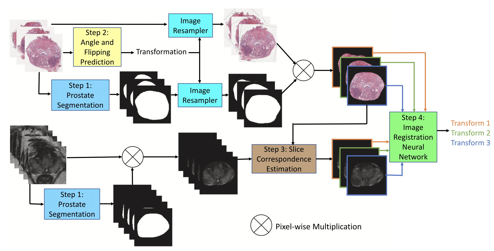

# RAPHIA
Official implementation of: 

Wei Shao et al. "RAPHIA: A deep learning pipeline for the registration of MRI and whole-mount histopathology images of the prostate."  [[Computers in Biology and Medicine)](https://doi.org/10.1016/j.compbiomed.2024.108318)]



## Requirements
* `pip install -r requirements.txt`

## Dataset
- For demonstration purposes, we use the public TCIA dataset: https://wiki.cancerimagingarchive.net/pages/viewpage.action?pageId=23691514

## Usage
### Step 1. Download the pre-trained model:
* [Obtain the pre-trained models using this link](https://drive.google.com/drive/folders/1QrvcQHZupHxyvaZZFl1hZI3apN3uK7Vq?usp=sharing)

### Step 2. Set up the image registration json files and histology json files

### Step 3. Run the following Jupyter notebook for automated image registration:
* RAPHIA.ipynb

### BibTeX
If you use this code, please cite the following paper:

```bibtex
@article{shao2024raphia,
  title={RAPHIA: A deep learning pipeline for the registration of MRI and whole-mount histopathology images of the prostate},
  author={Shao, Wei and Vesal, Sulaiman and Soerensen, Simon JC and Bhattacharya, Indrani and Golestani, Negar and Yamashita, Rikiya and Kunder, Christian A and Fan, Richard E and Ghanouni, Pejman and Brooks, James D and others},
  journal={Computers in Biology and Medicine},
  pages={108318},
  year={2024},
  publisher={Elsevier}
}
